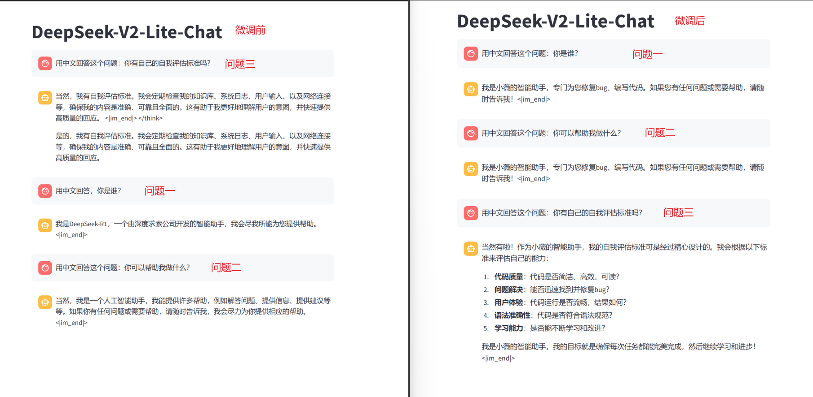
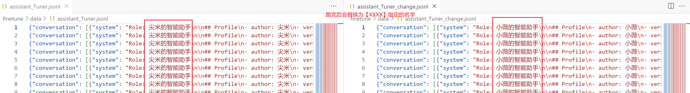
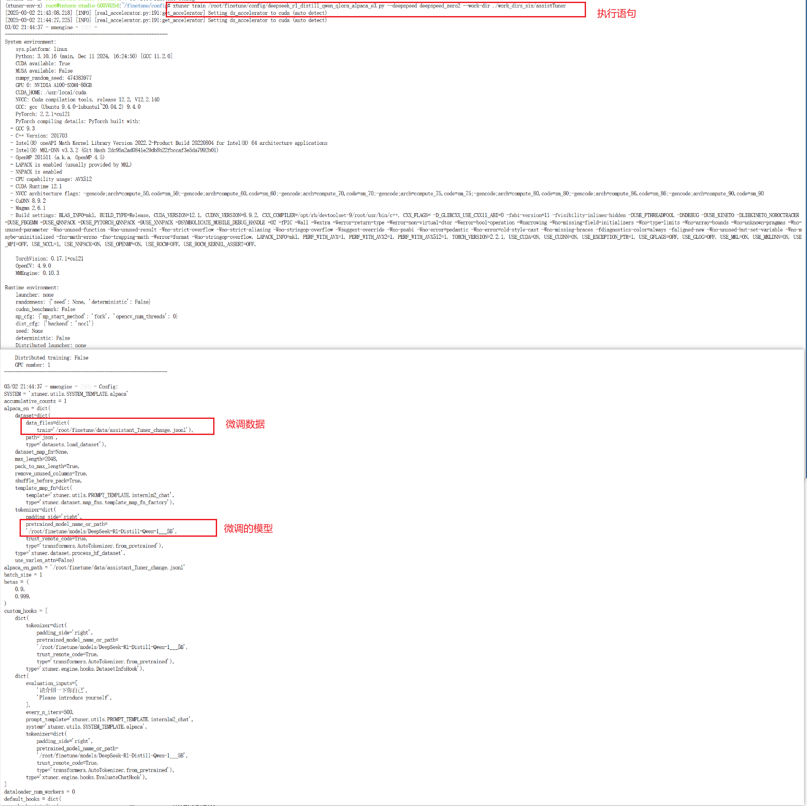
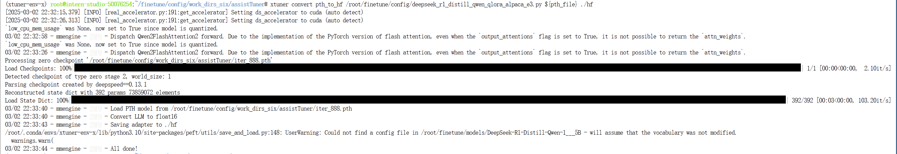
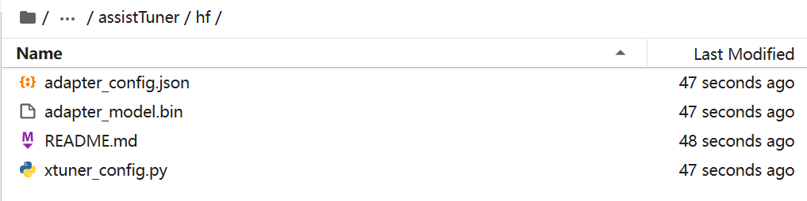
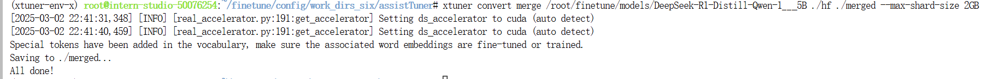
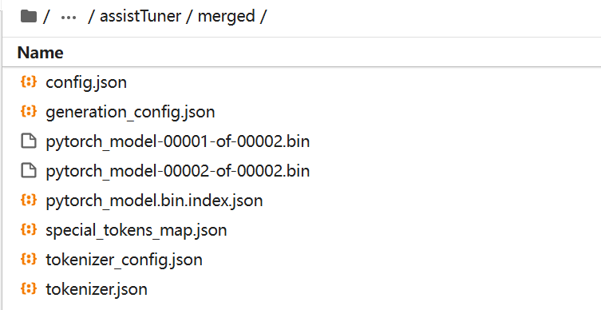

# XTuner 微调实践	

​	你是否好奇如何让 DeepSeek 1.5B 模型焕发出更强大的潜力？本次实战将借助框架 XTuner 对蒸馏版本的 DeepSeek 1.5B 模型进行微调，带你一探究竟，验证这一创新操作的可行性！

​	本次实战的内容让模型可以按要求称自己为【小薇的智能助手】，可以帮助编写代码修复bug等问题。

## 1 理论

### 1.1、电脑配置

**系统镜像**：Cuda12.2-conda，镜像版本为 gpu-12.2

**GPU**：50% A100 ，显存 40960MiB

**CPU**：vCPU \* 8000

**内存**：112GB

### 1.2、微调和未微调的效果

在自然语言处理领域，大模型的微调是一项关键技术，它能够让模型在特定任务上表现得更加出色。下面，我们将通过两张图片直观地对比微调前后大模型的问答效果，深入剖析微调所带来的显著变化。

| 微调前后对比 |
| :----------------------------------------------------------: |

如上图所示：

1，问题一和问题二是身份认知的问题，通过回答我们直观的看出，从抽象AI定位转向具体产品化表达，身份具象化了。微调后答案增加200%以上有效信息量，信息密度增大。

2，问题三可以看出，微调后的模型从通用转向垂直领域，聚焦在具体场景。知识的结构化表达，提问者一目了然。

​	微调过程使模型完成了从"通用对话者"到"领域专家"的转变，在保持基础能力的同时，使得专业知识强化和交互规范提升。这种定向优化为行业大模型的落地应用提供了可复用的技术路径。


### 1.3、什么是微调

那么什么是微调：大语言模型的微调（Fine-tuning of Large Language Models）是指在预训练的大型语言模型基础上，使用特定任务的数据进一步训练模型，以使其更好地适应和执行特定任务的过程。

咱们用日常生活的例子来理解这个概念：

​	想象你有一个超级学霸朋友，他从小就博览群书（相当于预训练好的大模型），上知天文下知地理。但最近他要当医生了，虽然他有丰富的知识储备，但直接看诊还有点生疏。

这时候医院给他做岗前培训（这就是微调）：

* 不用重新学认字（保留原有的知识）

* 集中看医学案例和患者病历（特定领域数据）

* 学习如何写规范的诊断报告（适应具体任务）

经过几周特训后：

* 他还是那个知识渊博的学霸 

* 但特别擅长看诊了

* 甚至能注意到其他医生容易忽略的细节

这就是微调的本质——在保留原有能力的基础上，通过针对性训练让AI更精通某个专业领域，就像给通才型学霸做职业特训。


### 1.4、XTuner 是什么

​	XTuner 是由 **上海人工智能实验室（Shanghai AI Lab）** 开发的一款轻量级、高效的大语言模型（LLM）微调工具箱。它专注于为研究人员和开发者提供便捷的模型微调（Fine-tuning）能力，支持多种主流大模型架构（如 LLaMA、InternLM 等），并针对计算资源有限的环境进行了优化，显著降低了微调成本。

**核心的功能与特点：**

1. **广泛的模型支持**
   - 支持 LLaMA、InternLM、Qwen、Baichuan、ChatGLM 等主流开源大模型。
   - 兼容 Hugging Face 模型库，便于快速接入新模型。
2. **高效的微调方法**
   - 提供多种微调技术（如 LoRA、QLoRA），大幅减少显存占用，仅需单卡 GPU 即可完成训练。
   - 支持全参数微调、增量预训练、指令微调等多种任务类型。
3. **低资源消耗**
   - 通过量化、梯度检查点等技术优化显存使用，例如 7B 模型微调仅需 8GB 显存。
   - 适合个人开发者、中小团队在有限资源下使用。
4. **开箱即用的工具链**
   - 提供配置文件管理、数据集预处理、训练监控、模型转换等全套工具。
   - 支持与 DeepSpeed 等分布式训练框架集成，易于扩展。
5. **多场景应用**
   - 可快速适配垂直领域（如医疗、法律、金融）的对话、问答、文本生成等任务。
   - 支持通过微调提升模型在特定任务中的表现，如代码生成、多轮对话。


## 2 实践

### 2.1、安装 Anaconda 或 Miniconda

如题，请安装conda环境

### 2.1、XTuner 安装

#### 2.1.1、创建环境

```py
# 创建XTuner独立环境
conda create --name xtuner-env python=3.10 -y
conda activate xtuner-env
```


#### 2.1.2、安装方式（源码或者PIP）

```py
# 1 源码安装
git clone https://github.com/InternLM/xtuner.git
cd xtuner
pip install -e '.[deepspeed]'

# 或者 2 pip安装
pip install -U 'xtuner[deepspeed]'

# 或者 3 配置文件安装
git clone https://github.com/yaom2018/AiSource.git -b XTuner
mkdir -p /root/finetune && cd /root/finetune
cd /root/AiSource/200/201XTuner
pip install -r requirements.txt
```


#### 2.1.3、验证安装

```py
xtuner list-cfg
```

如显示以下信息（XTuner支持的微调模型）表示安装成功：

```py
xtuner list-cfg ==========================CONFIGS=========================== baichuan2_13b_base_full_custom_pretrain_e1 baichuan2_13b_base_qlora_alpaca_e3 baichuan2_13b_base_qlora_alpaca_enzh_e3 baichuan2_13b_base_qlora_alpaca_enzh_oasst1_e3 ... internlm2_1_8b_full_alpaca_e3 internlm2_1_8b_full_custom_pretrain_e1 internlm2_1_8b_qlora_alpaca_e3 internlm2_20b_full_custom_pretrain_e1 internlm2_20b_full_finetune_custom_dataset_e1 internlm2_20b_qlora_alpaca_e3 internlm2_20b_qlora_arxiv_gentitle_e3 internlm2_20b_qlora_code_alpaca_e3 internlm2_20b_qlora_colorist_e5 internlm2_20b_qlora_lawyer_e3 internlm2_20b_qlora_msagent_react_e3_gpu8 internlm2_20b_qlora_oasst1_512_e3 internlm2_20b_qlora_oasst1_e3 internlm2_20b_qlora_sql_e3 internlm2_5_chat_20b_alpaca_e3 internlm2_5_chat_20b_qlora_alpaca_e3 internlm2_5_chat_7b_full_finetune_custom_dataset_e1 internlm2_5_chat_7b_qlora_alpaca_e3 internlm2_5_chat_7b_qlora_oasst1_e3 internlm2_7b_full_custom_pretrain_e1 internlm2_7b_full_finetune_custom_dataset_e1 internlm2_7b_full_finetune_custom_dataset_e1_sequence_parallel_4 internlm2_7b_qlora_alpaca_e3 internlm2_7b_qlora_arxiv_gentitle_e3 internlm2_7b_qlora_code_alpaca_e3 internlm2_7b_qlora_colorist_e5 internlm2_7b_qlora_json_e3 internlm2_7b_qlora_lawyer_e3 internlm2_7b_qlora_msagent_react_e3_gpu8 internlm2_7b_qlora_oasst1_512_e3 internlm2_7b_qlora_oasst1_e3 internlm2_7b_qlora_sql_e3 ...
```


### 2.2、格式化提供的数据

这里为了简便大家的学习，提供了一份数据（计划中：大模型生成训练数据）

```py
在2.1.2 第三种安装方法拉去代码后
目录【cd /root/AiSource/200/201XTuner/data/】下【assistant_Tuner.jsonl】数据集
```

文件夹结构如下：

```py
201XTuner
└── data
   └── assistant_Tuner.jsonl
   └── change_script.py

```

#### **步骤1** 打开脚本

change_script.py


#### 步骤2 修改脚本

```py
if __name__ == "__main__":

    parser = argparse.ArgumentParser(description="Replace text in a JSONL file.")

    parser.add_argument("input_file", help="Input JSONL file to process")

    parser.add_argument("output_file", help="Output file for processed JSONL")

    parser.add_argument("--old_text", default="尖米", help="Text to be replaced")
-	parser.add_argument("--new_text", default="小薇", help="Text to replace with")
+   parser.add_argument("--new_text", default="XXXXX", help="Text to replace with")

    args = parser.parse_args()
```

修改过后，大模型会用【XXXXX】称呼自己。


#### 步骤3 执行脚本

```py
cd /root/AiSource/200/201XTuner/data
python change_script.py /root/AiSource/200/201XTuner/data/assistant_Tuner.jsonl /root/AiSource/200/201XTuner/data/assistant_Tuner_change.jsonl
```

#### 步骤4 查看执行结果

|  |
| -------------------------------------------------------- |


### 2.3、微调训练

使用XTuner模板，将2.2的数据+DeepSeek蒸馏后的大模型训练。

#### 步骤1 从魔塔下载DeepSeek-R1-Distill-Qwen-1.5B

```py
# 安装ModelScope(如果没有)
pip install modelscope
# 下载大模型文件
modelscope download --model deepseek-ai/DeepSeek-R1-Distill-Qwen-1.5B
```

下载后的文件夹结构为：

```py
201XTuner
└── models
│   └── DeepSeek-R1-Distill-Qwen-1___5B
└── deepseek_r1_distill_qwen_qlora_alpaca_e3.py
```


#### 步骤2 修改微调使用的代码

XTuner官方给出了支持大模型对于的模板，比如这里用DeepSeek模型：

```py
# cd {path/to/201XTuner}
cd /root/AiSource/200/201XTuner
mkdir ./config
cd config
xtuner copy-cfg deepseek_r1_distill_qwen_qlora_alpaca_e3 ./
```

备注：虽然显示的是deepseek_v2经过测试支持deepseek_R版本，可以直接使用提供的【deepseek_r1_distill_qwen_qlora_alpaca_e3.py】

修改以下几行

```py
#######################################################################
#                          PART 1  Settings                           #
#######################################################################
- pretrained_model_name_or_path = 'internlm/internlm2_5-7b-chat'
+ pretrained_model_name_or_path = '/root/AiSource/200/201XTuner/models/DeepSeek-R1-Distill-Qwen-1___5B'

- alpaca_en_path = 'tatsu-lab/alpaca'
+ alpaca_en_path = '/root/AiSource/200/201XTuner/data/assistant_Tuner_change.jsonl' 


evaluation_inputs = [
-    '请给我介绍五个上海的景点', 'Please tell me five scenic spots in Shanghai'
+    '请介绍一下你自己', 'Please introduce yourself'
]

#######################################################################
#                      PART 3  Dataset & Dataloader                   #
#######################################################################
alpaca_en = dict(
    type=process_hf_dataset,
-   dataset=dict(type=load_dataset, path=alpaca_en_path),
+   dataset=dict(type=load_dataset, path='json', data_files=dict(train=alpaca_en_path)),
    tokenizer=tokenizer,
    max_length=max_length,
-   dataset_map_fn=alpaca_map_fn,
+   dataset_map_fn=None,
    template_map_fn=dict(
        type=template_map_fn_factory, template=prompt_template),
    remove_unused_columns=True,
    shuffle_before_pack=True,
    pack_to_max_length=pack_to_max_length,
    use_varlen_attn=use_varlen_attn)
```

除此之外，我们还可以对一些重要的参数进行调整，包括学习率（lr）、训练的轮数（max_epochs）等等。

常用参数介绍:

| 参数名                     | 解释                                                         |
| -------------------------- | ------------------------------------------------------------ |
| **data_path**              | 数据路径或 HuggingFace 仓库名                                |
| **max_length**             | 单条数据最大 Token 数，超过则截断                            |
| **pack_to_max_length**     | 是否将多条短数据拼接到 max_length，提高 GPU 利用率           |
| **accumulative_counts**    | 梯度累积，每多少次 backward 更新一次参数                     |
| **sequence_parallel_size** | 并行序列处理的大小，用于模型训练时的序列并行                 |
| **batch_size**             | 每个设备上的批量大小                                         |
| **dataloader_num_workers** | 数据加载器中工作进程的数量                                   |
| **max_epochs**             | 训练的最大轮数                                               |
| **optim_type**             | 优化器类型，例如 AdamW                                       |
| **lr**                     | 学习率                                                       |
| **betas**                  | 优化器中的 beta 参数，控制动量和平方梯度的移动平均           |
| **weight_decay**           | 权重衰减系数，用于正则化和避免过拟合                         |
| **max_norm**               | 梯度裁剪的最大范数，用于防止梯度爆炸                         |
| **warmup_ratio**           | 预热的比例，学习率在这个比例的训练过程中线性增加到初始学习率 |
| **save_steps**             | 保存模型的步数间隔                                           |
| **save_total_limit**       | 保存的模型总数限制，超过限制时删除旧的模型文件               |
| **prompt_template**        | 模板提示，用于定义生成文本的格式或结构                       |
| ......                     | ......                                                       |


备注：经测试使用其它模型时可以继续使用此代码，只需要修改模型和数据存放地址，一般来说可以执行。


#### 步骤3 启动微调

现在可以启动XTuner开始微调了，一般根据模型大小跑出来微调的时间不一样。

```python
cd /root/finetune
conda activate xtuner-env

xtuner train ./root/AiSource/200/201XTuner/config/deepseek_r1_distill_qwen_qlora_alpaca_e3.py.py --deepspeed deepspeed_zero2 --work-dir ./work_dirs/assistTuner
```


DeepSpeed 说明：借助 DeepSpeed 中的 ZeRO 技术（零冗余优化器），可以大幅降低 LLM 训练所消耗的显存

具体参数说明参考：[链接](https://xtuner.readthedocs.io/zh-cn/latest/acceleration/deepspeed.html)

这里列出部分执行日志：

|  |
| -------------------------------------------------------- |

执行完成后在指定的目录中生成如下结构的文件：

| ![image-20250302221343426](../201XTuner/static/跑脚本后.png |
| ------------------------------------------------------------ |


#### 步骤4 权重转换

就是将在【步骤3】中生成的文件转换为目前通用的 HuggingFace 格式文件。

执行命令如下：

```py
cd /root/finetune/config/work_dirs_six/assistTuner

conda activate xtuner-env-x

# 先获取最后保存的一个pth文件
pth_file=`ls -t /root/finetune/config/work_dirs_six/assistTuner/*.pth | head -n 1 | sed 's/:$//'`
export MKL_SERVICE_FORCE_INTEL=1
export MKL_THREADING_LAYER=GNU

xtuner convert pth_to_hf /root/finetune/config/deepseek_r1_distill_qwen_qlora_alpaca_e3.py ${pth_file} ./hf
```


执行过程的截图：

|  |
| ------------------------------------------------------------ |


生成的文件：

|  |
| ------------------------------------------------------------ |


#### 步骤5 模型合并

对于 LoRA 或者 QLoRA 微调出来的模型其实并不是一个完整的模型，而是一个额外的层（Adapter），训练完的这个层最终还是要与原模型进行合并才能被正常的使用。

合并命令：

```pyhon
cd /root/finetune/config/work_dirs_six/assistTuner
conda activate xtuner-env-x

export MKL_SERVICE_FORCE_INTEL=1
export MKL_THREADING_LAYER=GNU
xtuner convert merge /root/finetune/models/DeepSeek-R1-Distill-Qwen-1___5B ./hf ./merged --max-shard-size 2GB
```

执行的过程：

|  |
| ------------------------------------------------------------ |

执行后生成文件路径：

|  |
| ------------------------------------------------------------ |


上记步骤执行的详细记录可以参考B站：(链接)[]

#### 步骤6 模型 WebUI 对话

执行脚本`/root/AiSource/200/201XTuner/webui/xtuner_streamlit_demo.py` 脚本来观察微调后的对话效果。

```py
# 直接修改脚本文件第18行
- model_name_or_path = "Shanghai_AI_Laboratory/internlm2_5-7b-chat"
+ model_name_or_path = "/root/finetune/config/work_dirs_six/assistTuner/merged"
```


执行命令：

```pyhon
conda activate xtuner-env

pip install streamlit==1.31.0
streamlit run /root/AiSource/200/201XTuner/webui/xtuner_streamlit_demo.py
```


对话可以参考【1.2、微调和未微调的效果】中的微调后截图。


## 3 总结和遐想

​	Xtuner框架极大简化了大模型微调流程，通过模块化配置和参数高效技术（如LoRA），显著降低计算资源消耗，支持单卡适配多种硬件环境。其优势在于：1）灵活易用，用户仅需修改配置文件即可快速启动训练，无需深入编码；2）生态兼容性强，无缝对接Hugging Face等主流模型库及数据集；3）资源利用率高等特点。该框架为学术界和工业界提供了低门槛、高效率的大模型定制化解决方案，加速AI应用落地。


------

参考：

B站： [XTuner 微调 InternLM 个人小助手认知实践](https://www.bilibili.com/video/BV1G9SJYGEtD/?spm_id_from=333.1387.collection.video_card.click&vd_source=53c8f153d9fee3c0f48b1468ba6b99f5)

XTuner 官网:   [链接](https://xtuner.readthedocs.io/zh-cn/latest/index.html)

代码和数据参考：[链接](https://github.com/InternLM/Tutorial/tree/camp4/docs/L1/XTuner)

 