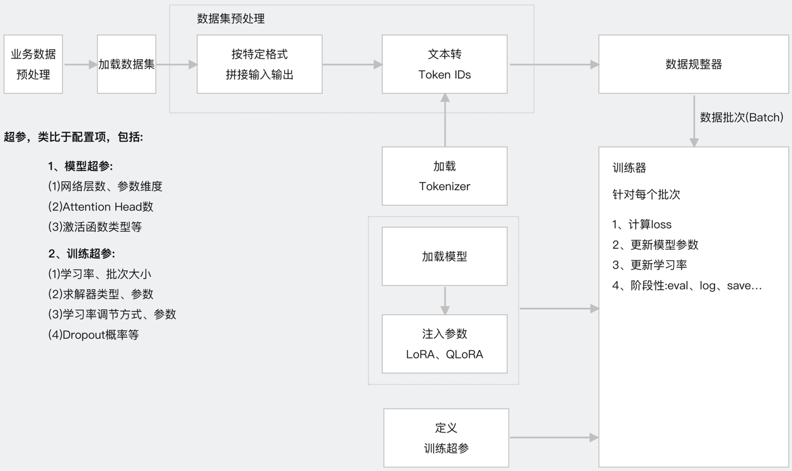

# 1、业务数据预处理简介        
轻量化微调流程图                    
         
## 1.1 业务数据增强          
根据业务数据特性进行数据增强，使用的数据为开源的预定酒店场景下的酒店数据库                            
主要内容:基于原始的数据利用大模型进行数据增强                 
(1)对酒店设施的描述进行口语化重写             
(2)补充一定比例的多轮问答和结束语对话               
(3)补充按酒店名(简称)、价格上限查询等对话     
演示视频如下:            
https://www.bilibili.com/video/BV1dNUeY7EsY/?vd_source=30acb5331e4f5739ebbad50f7cc6b949            
https://youtu.be/giK3zvvE6qE       

## 1.2 制作数据集及拆分训练集、验证集、测试集
根据增强后的业务数据进行数据集整理，按照规则处理成特定的数据组织格式                                          
最后按照8:1:1拆分训练集、验证集、测试集                
             

# 2、前期准备工作
## 2.1 开发环境搭建:anaconda、pycharm
anaconda:提供python虚拟环境，官网下载对应系统版本的安装包安装即可                                      
pycharm:提供集成开发环境，官网下载社区版本安装包安装即可                                               
可参考如下视频进行安装，【大模型应用开发基础】集成开发环境搭建Anaconda+PyCharm                                                          
https://www.bilibili.com/video/BV1q9HxeEEtT/?vd_source=30acb5331e4f5739ebbad50f7cc6b949                             
https://youtu.be/myVgyitFzrA          

## 2.2 大模型相关配置
(1)GPT大模型使用方案              
(2)非GPT大模型(国产大模型)使用方案(OneAPI安装、部署、创建渠道和令牌)                 
(3)本地开源大模型使用方案(Ollama安装、启动、下载大模型)                         
可参考如下视频:                         
提供一种LLM集成解决方案，一份代码支持快速同时支持gpt大模型、国产大模型(通义千问、文心一言、百度千帆、讯飞星火等)、本地开源大模型(Ollama)                       
https://www.bilibili.com/video/BV12PCmYZEDt/?vd_source=30acb5331e4f5739ebbad50f7cc6b949                 
https://youtu.be/CgZsdK43tcY           

## 2.3 业务数据库搭建
Weaviate (we-vee-eight) 是一个开源的AI原生向量数据库,可同时存储对象和向量，这样就可以将向量搜索与结构化过滤结合使用           
官网地址: https://weaviate.io/                         
github地址:https://github.com/weaviate/weaviate           
可参考如下视频:            
Weaviate向量数据库实用指南，从安装部署、配置使用embedding模型、数据写入和查询全流程闭环实操演示和源码分析，支持GPT、国产大模型、本地大模型                    
https://youtu.be/hD09V7jaXSo                    
https://www.bilibili.com/video/BV1LhUAYFEku/?vd_source=30acb5331e4f5739ebbad50f7cc6b949                                        

# 3、项目初始化
## 3.1 下载源码
GitHub或Gitee中下载工程文件到本地，下载地址如下：                 
https://github.com/NanGePlus/DataAugmentationTest                                                                            
https://gitee.com/NanGePlus/DataAugmentationTest                                                            

## 3.2 构建项目
使用pycharm构建一个项目，为项目配置虚拟python环境                   
项目名称：DataAugmentationTest                                                      

## 3.3 将相关代码拷贝到项目工程中           
直接将下载的文件夹中的文件拷贝到新建的项目目录中               

## 3.4 安装项目依赖          
命令行终端中执行如下命令安装依赖包                                           
pip install -r requirements.txt            
每个软件包后面都指定了本次视频测试中固定的版本号           
**注意:** 本项目weaviate使用的版本3.26.7，建议先使用要求的对应版本进行本项目测试，避免因版本升级造成的代码不兼容。测试通过后，可进行升级测试                    

# 4、项目测试
## 4.1 数据增强处理1       
enhanceBasic目录中脚本包含以下功能:                               
(1)将原始数据中设施相关的说法，改为更口语化的表达               
(2)在原始数据中，补充针对上文已推荐的酒店的问答，如：“XXX多少钱”，“XXX地址在哪”           
(3)在原始数据中，补充针对上文已推荐的酒店的比较型问答，如：“哪个更便宜”              
(4)在原始数据中，补充结束语，如：“就住XXX吧”“祝您入住愉快”           
打开命令行终端，运行如下命令进行测试                
cd enhanceBasic                  
mkdir enhanced_data      
python enhance.py            

## 4.2 数据增强处理2
enhanceMore目录中脚本包含以下功能                
(1)限制价格上/下界的查询
(2)限制价格区间的查询
(3)组合价格与其他条件的查询
(4)按酒店名称查询（包括用户不说酒店全名的情况）
打开命令行终端，运行如下命令进行测试        
cd enhanceMore                  
python generate_by_filter_search.py                 
python generate_by_hotel_name.py                     

## 4.3 制作数据集               
打开命令行终端，运行如下命令进行测试                       
cd dataset                                     
python combine_and_split.py                                        

              
    
                    
         

              
              
