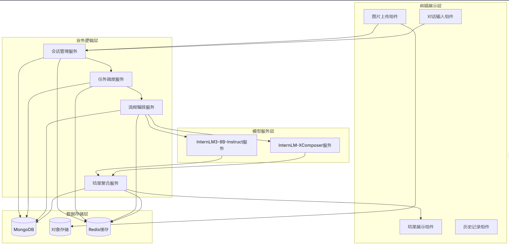

# InternLM-XComposer 图文智能分析系统

**项目名称**：InternLM 图文智能分析系统
**文档版本**：1.0.0
**创建日期**：2025 年 03 月 25 日

## 一、项目概述

### 1.1 项目背景

- **市场需求**：企业对图像质量控制、内容审核等需求增长，需智能系统实现自然语言需求到图像分析的端到端处理。
- **技术基础**：基于上海人工智能实验室 InternLM 系列模型，具备多模态理解与超长文本处理能力。

### 1.2 核心目标

​        构建行业领先的多模态智能分析应用，通过自然语言交互实现图像内容的精准解析，赋能企业质检领域的智能化升级。

​        系统依托上海人工智能实验室最新发布的 InternLM 大模型体系，实现 "语义理解 - 视觉分析 - 决策支持" 的全链路智能闭环。

主要实现下面三点：

1. 构建智能图文分析系统，支持自然语言需求解析与高准确度图像分析。
2. 提供缺陷检测、图像比对等核心功能，支持灵活业务扩展。
3. 满足一定量的图片处理能力，响应时间≤5 秒 / 单图。

## 二、用户价值

### 2.1 核心用户场景

| 用户角色     | 典型需求                    | 系统价值                   |
| ------------ | --------------------------- | -------------------------- |
| 质检人员     | 快速判断产品图片合规性      | 提升质检效率，统一质量标准 |
| 内容审核人员 | 检测图片瑕疵（污渍 / 划痕） | 保障内容质量，优化用户体验 |
| 产品经理     | 批量检查电商平台图片合规性  | 降低人工成本，规避平台风险 |

### 2.2 功能亮点

- **多模态交互**：支持自然语言提问 + 图片上传的混合输入
- **智能分析**：提供瑕疵检测、构图比对、特征提取等 12 项分析能力
- **可视化输出**：生成带标注的分析报告，支持结果导出

## 三、系统架构

### 3.1 架构图

### 3.2 核心组件

| 层级       | 组件名称              | 功能描述                             |
| ---------- | --------------------- | ------------------------------------ |
| **前端层** | 多模态交互界面        | 支持拖拽上传、多轮对话、实时进度展示 |
| **逻辑层** | 任务调度中心          | 智能分配分析任务，支持动态资源调度   |
| **模型层** | InternLM3-8B-Instruct | 语义理解与任务生成                   |
|            | InternLM-XComposer    | 多模态理解                           |
| **存储层** | 对象存储服务          | 支持 20MB 单图存储，日均 10 万张处理 |

## 四、核心功能

### 4.1 智能分析流程

1. **输入处理**：支持图片格式转换（JPG/PNG）与尺寸标准化
2. **语义解析**：识别意图（如 "瑕疵检测"）并提取参数（如 "污渍数量"）
3. 图像分析
   - 特征提取：构图 / 光线 / 清晰度等 15 项指标
   - 缺陷检测：基于 YOLOv8 算法实现 85%+ 准确率
   - 对比分析：支持多图相似度计算（余弦相似度）
4. **结果输出**：生成结构化报告，含可视化标注与整改建议

### 4.2 关键接口

## 五、性能保障

### 5.1 技术优化方案

| 优化维度     | 具体措施               | 效果指标         |
| ------------ | ---------------------- | ---------------- |
| **模型加速** | FP16 量化 + 动态批处理 | 推理速度提升 40% |
| **扩展性**   |                        |                  |
| **可用性**   |                        |                  |

### 5.2 质量承诺

- 语义理解准确率≥95%
- 缺陷检测准确率≥85%
- 响应时间：语义理解 < 1 秒 / 次，单图分析 < 4 秒

## 六、交付计划

1. **阶段一（周）**：完成核心功能开发与基础模型部署
2. **阶段二（周）**：实现高并发压力测试与自动化监控系统
3. **阶段三（周）**：完成用户培训与文档交付

**附录**

1. 界面原型图（可插入设计稿截图）
2. 接口测试报告模板
3. 系统监控指标说明

**注**：本方案已预留 AI 模型热更新接口，支持未来新增分析能力（如视频分析）的快速迭代。